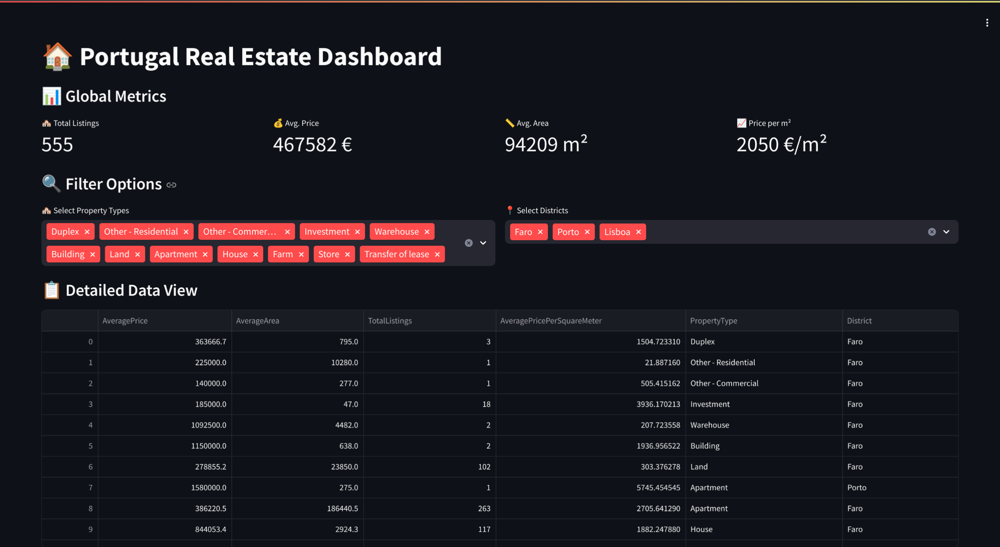
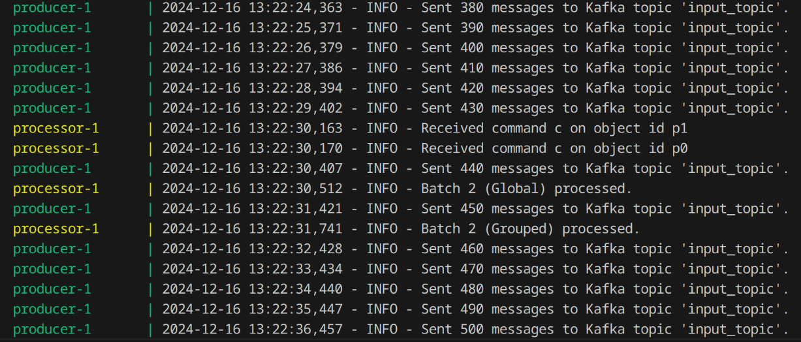
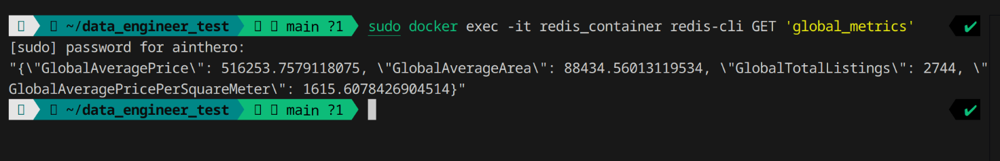

# Portugal Real Estate Dashboard

**Запуск**

1. ```bash
   git clone https://github.com/ainthero/DataEngineerTest.git
   ```

2. ```bash
   cd DataEngineerTest
   ```

3. ```bash
   docker-compose up --build
   ```

4. Дашборд открывается по ссылке http://localhost:8501

Для очистки топика в Kafka и статистики в Redis cleanup.sh.

**Описание**

1.  Producer читает input_data.csv и отправляет в топик Kafka со скоростью 10 строк в секунду.

2. Processor представляет собой PySpark скрипт. Читает топик Kafka, отфильтровывает объявления с ценой ниже 50,000 евро или площадью менее 20 квадратных метров. Считает
      * Среднюю цену недвижимости
      * Среднюю площадь
      * Общее количество объявлений
      * Среднюю цену за квадратный метр
   
      для всего потока отдельно и для каждой группы property_type и district. Все это сохраняет в Redis. Если хоть одно из нужных полей NULL, то запись отфильтровывается.

3. Dashboard рисует статистику из Redis.

**Скриншоты**


*Рисунок 1: Дашборд.*



*Рисунок 2: Логи processor и producer.*



*Рисунок 3: Метрики в Redis.*

